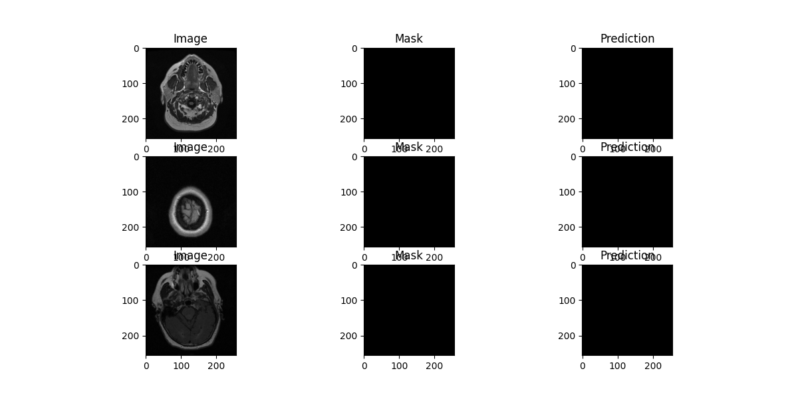

# Brain MRI Tumor Segmentation with Deep Learning

[](https://www.python.org/)
[](https://pytorch.org/)
[](#dataset)

A deep learning–based semantic segmentation pipeline for brain MRI images,
implemented using PyTorch and a Fully Convolutional Network (FCN).

Created for the **Computer Vision and Artificial Intelligence (CVIA) assignment**.

---

## 1. Problem context

* **Problem**
  Accurate segmentation of brain tumor regions in MRI scans is essential
  for diagnosis, treatment planning, and disease monitoring.

* **Medical imaging value**
  Manual segmentation is time-consuming and subject to inter-observer variability.
  Automated segmentation improves consistency and scalability in clinical workflows.

* **Challenges**
  Low contrast in MRI images; irregular tumor shapes; class imbalance
  between tumor and background pixels.

---

## 2. Environment

| Layer        | Choice                                   |
|--------------|------------------------------------------|
| Framework    | PyTorch / Torchvision                    |
| Model        | FCN with ResNet-50 backbone              |
| Execution    | Google Colab                             |
| Hardware     | CPU / GPU (Colab runtime)                |
| Notebook     | Jupyter Notebook (.ipynb)                |

### Project Layout
<pre><code>
medical-image-segmentation-dl/
  ├── medical_image_segmentation_dl.ipynb  # Executed notebook with results
  ├── output.png                           # Sample prediction visualization
  ├── requirements.txt                     # Python dependencies
  └── README.md                            # Project documentation
</code></pre>

---

## 3. Dataset

- **Name:** LGG MRI Segmentation Dataset
- **Source:** Kaggle (mateuszbuda/lgg-mri-segmentation)
- **Images:** Brain MRI scans (.tif)
- **Labels:** Binary tumor masks

The dataset is downloaded programmatically using `kagglehub` and is
**not included in this repository** due to size constraints.

---

## 4. Requirements

Install dependencies with:
```bash
pip install -r requirements.txt
```

| Package | Version | Purpose |
|---------|---------|---------|
| torch | ≥2.0.0 | Deep learning framework |
| torchvision | ≥0.15.0 | FCN ResNet-50 model, transforms |
| opencv-python | ≥4.8.0 | Image I/O, processing |
| numpy | ≥1.24.0 | Array operations |
| scikit-learn | ≥1.3.0 | Train/validation split |
| matplotlib | ≥3.7.0 | Visualization |
| kagglehub | ≥0.3.0 | Dataset download |

---

## 5. Data preprocessing

```
read image & mask (.tif)
resize           → 256 × 256
convert grayscale → 3-channel image
normalize         → mean = 0.5, std = 0.5
binarize mask     → tumor / background
```

---

## 6. Deep learning model

| Setting        | Value                              |
|----------------|------------------------------------|
| Architecture   | FCN (ResNet-50 backbone)           |
| Classifier     | Custom 2-class head (2048 → 2)     |
| Aux Classifier | Disabled                           |
| Loss           | Cross-Entropy Loss                 |
| Optimizer      | Adam                               |
| Learning rate  | 1e-4                               |
| Batch size     | 4                                  |
| Epochs         | 3                                  |
| Split          | 80 % train / 20 % validation       |

---

## 7. Evaluation

**Metric:** Dice Similarity Coefficient (DSC)

**Result:**
```
Average Dice Score ≈ 0.75
```

This result is reasonable for a short training run and demonstrates
the model's ability to segment tumor regions in brain MRI images.

---

## 8. Visualization

The notebook produces qualitative results showing:

- Input MRI image
- Ground-truth tumor mask
- Model prediction



---

## 9. Notes

The notebook was executed using Google Colab to ensure a stable
PyTorch environment.

Local execution may require additional setup depending on the system
and PyTorch installation.

---

## 10. Author

Developed as part of the
Computer Vision and Artificial Intelligence (CVIA) module assignment.
